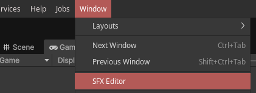
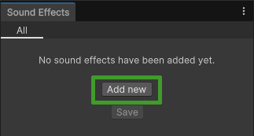
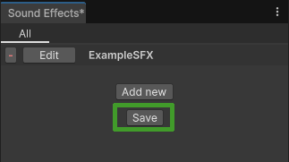

## QUICKSTART

### Creating sound effects

1. **Open the Sound Effects List window** in the Window/SFX Editor tab
    - You can also access this, and some settings, through the SFX List asset, located by default in Assets/Resources/SFX List.asset. This is created when you install the plugin.



2. Click **Add new**
    - Tip: The Sound Effects window can be docked to any spot in the editor, like any window



3. **Type in a name** for your sound effect. It must be alphanumeric, and cannot begin with a number.

4. Click **Edit** on your new sound effect.

5. Specify the Audio Clip(s) to play
    - If you want to play a random clip, or randomize volume/pitch, click the *Randomize?* toggle!

6. Click **Save** in the Sound Effects window when you're done.
    - You only need to click Save if you've added or removed a sound effect to the list. Edits to individual sound effects will be saved automatically.



7. Unity should now start recompiling C# scripts.
    - This is because the plugin generates a script in the background, located by default in *Assets/Scripts/SFXEnum.cs*, with static members that refer to each sound effect, for ease of use.

You now have your first sound effect!

### Playing sound effects

8. Go to any script in your game

9. Make sure you have `using Cu1uSFX;` on the top of your script

10. To play your new sound effect, simply call `SFXPlayer.Play(SFX.YourSFXName);`
    - You can also use `SFX.YourSFXName.Play()` to do the same thing.

Example:

```cs
using Cu1uSFX;
public class Example : MonoBehaviour
{
    public void PlaySounds()
    {
        SFX.YourSound.Play();
        // OR
        SFXPlayer.Play(SFX.YourSound);
    }
}
```

11. Done! Your sound effect will now play ingame when the code is run.

**BONUS:** You can also play AudioClips directly from any script using `audioClip.Play();` or `SFXPlayer.Play(audioClip);`, if your script contains `using Cu1uSFX;`

Check out [Tips and Tricks](./Tips%20and%20Tricks.md) for more advanced use cases!


Copyright © 2025 Måns Fritiofsson
